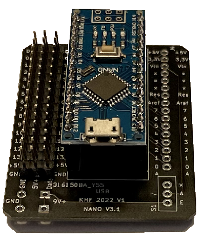
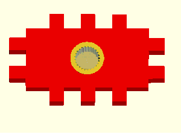
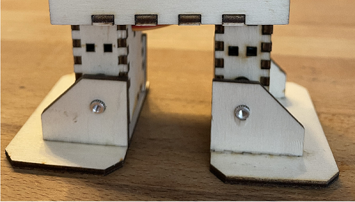
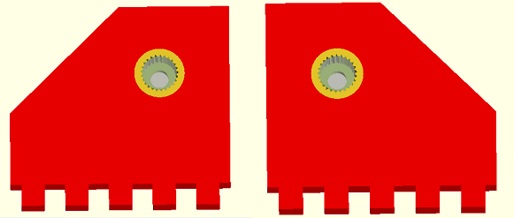
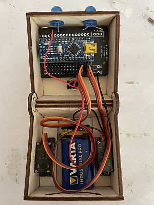

|[:skull:ISSUE](https://github.com/frankyhub/Robi/issues?q=is%3Aissue)|[:speech_balloon: Forum /Discussion](https://github.com/frankyhub/Robi/discussions)|[:grey_question:WiKi](https://github.com/frankyhub/Robi/wiki)||
|--|--|--|--|
| | | | |
||<a href="https://github.com/frankyhub/Robi/issues">|<a href="https://github.com/frankyhub/Robi/discussions">|<a href="https://github.com/frankyhub/Robi/releases">|
|| <a href="https://github.com/frankyhub/Robi/pulse" alt="Activity">| <a href="https://github.com/frankyhub/Robi/graphs/traffic">  |<a href="https://github.com/frankyhub?tab=stars"> |

---

   
<ol class="breadcrumb" style="border-top: 2px solid black;border-bottom:2px solid black; height: 45px; width: 900px;"> 
<a href="#oben">nach oben</a>
</ol>

  

---

# Robi
 ## 3D-Druck- und Lasercutter-Version

## Robi Lasercutter Montage Anleitung

## Story:
Diese Anleitung beschreibt die Montage eines Roboters. Robi kann laufen, tanzen und den Moonwalk. Jedes Bein hat zwei Gelenke, die von Servo-Motoren bewegt werden. Als Steuerung dient ein Arduino NANO, gespeist von einer 9V-Batterie.
Die Robi-Elemente werden aus einer 3mm Sperrholzplatte gelasert, ebenso ist ein 3D-Druck Gehäuse möglich.

## Entwerfe dein eigenes Robi Design mit Inkscape

Downlaod [Inkscape-Vorlage](svg/Charley.svg)

## Die Stückliste:

| Anzahl | Bezeichnung | 
| -------- | -------- | 
| 1  | Sperrholzplatte 300x300x3mm  | 
|  1 | NANO-Shield  | 
| 1  | Arduino NANO V3  | 
|  1 | NANO-Shield  | 
| 1  |  40 Pin Male 2,54mm Stiftleisten einreihig für das NANO-Shield | 
|  1 |  40 Pin Female 2,54 mm Buchsenleiste einreihig für das NANO-Shield | 
| 1  | Schalter 1 polig  | 
| 2  | Jumbo LEDs  | 
| 1  | 1K Ohm Widerstand  | 
| 1  | 9V Batterie  | 
| 1  | 9V Batterie-Klipp  | 
| 4  | Servo Motore SG90  | 
| 2  | Zylinderkopf Schrauben M3x8  | 
| 1  | Kabelbinder 10cm  | 
| 1  | Holzleim  | 
| 1  | Sekundenkleber  | 
| 1  | 20cm Schaltlitze 0,25mm2  | 

## Bauteilbilder der Stückliste

## Der NANO mit [Shield](https://github.com/frankyhub/KiCad-Shield/tree/main/NANO_Bot) und Stiftleisten

## Aufbau und Montage

Der Aufbau und die Montage von Robi ist in mehrere Schritte unterteilt

## Schritt 1: 
Überprüfe die Laserteile auf Vollständigkeit.
Verwende die Lasercutter Vorlage, bestehend aus:
+ 1 x Kopf Oberteilteil
+ 1 x Kopf Unterteil
+ 2 x Füße
+ 2 x Schuhe

Lasercutter-Datei (3mm Sperrholz)

 Füße und Schuhe (3mm Sperrholz)

## Schritt 2: 
Das Kopf Oberteil montieren.

## Schritt 3: 
Das Kopf Unterteil montieren.
Achtung: Das rechte und linke Seitenteil mit dem Gelenk zum Schluss zusammen mit dem Kopf Oberteil montieren!

Im Kopf Unterteil die Halterungen für die Servos kleben

Die Hülle der beiden Füße verkleben.
Achtung: Wir benötigen zwei Füße. Die Öffnungen für die Servokabel sind jeweils innen und die Servos zeigen nach vorne!

Die beiden Oberteile der Füße deckungsgleich verkleben (noch nicht an die Füße kleben!).

Die Oberteile der Füße werden an den Servo im Kopfteil geschraubt.

Alternativ können zu besseren Stabilität auch die 3D-Druck Teile verwendet werden.

## Schritt 4: 
Den Robi verdrahten, die Bauteile jedoch noch nicht in das Gehäuse montieren.

## Schritt 5: 
Vor der Montage der Servos ist ein Funktionstest sinnvoll:
Den Robi mit der Arduino IDE in C++ oder in Blocksprache programmieren.
Ist der Robi programmiert und sind die Servos in 90° Stellung, können sie in das Kopf-Unterteil und in die Füße montiert werden.

## Schritt 6: 
Die beiden Servos in 90° Stellung mit den unteren Kopfteil und den Oberteil der Füße verschrauben. Die Servos sollten durch die Verschraubung fest am Kopfteil sitzen. Anschließend die 9V-Batterie mit den Kabelbinder befestigen.

 

Die Schrittmotore in die Fußhülle montieren und das Fuß Unterteil ankleben

Die Schuhe an die Füße montieren

Die Servo-Kabel in den Body führen und die Füße an die Fußoberteile kleben

Alternativ können zu besseren Stabilität auch die 3D-Druck Teile verwendet werden.

## Schritt 7: 
Den NANO in das obere Kopfteil montieren
Platinenhalter auf das Shield kleben und das Shield anschließend in das innere, obere Kopfteil kleben. Daneben den Schalter montieren und verdrahten.
Vor dem endgültigen verkleben des NANOs in das Obere Kopfteil, sollte er fertig programmiert sein.
Optional noch zwei LEDs mit 1kOhm Vorwiderstand an 9V als Augen verwenden.

Einbau des NANO und der Battierie in den Robi-Kopfteil

Anschlüsse der LEDs

Anschluss des Batterieclips, des Schalters und der LEDs

Fertig, Glückwunsch!

## Technische Hinweise

Anschlüsse des Servo-Motor SG90/MG90:

## Servo-Motor Impulsdiagramme:

Impulsdiagramm: Ansteuerung des Servos mit einer Frequenz von 50 Hz:

Impulsdiagramm: Ansteuerung des Servos mit einer Impulsbreite von 2,5ms (180°):

Blocky Beispiel Programme:

[Robi kalibirieren](blocky/robi_kalibrieren.bloc)

[Robi geht vorwärts](blocky/robi_vorwaerts.bloc)

[Robi tanzt I](blocky/robi_tanzt.bloc)

[Robi tanzt II](blocky/robi_zufall.bloc)

## Fertig!

---

   
<ol class="breadcrumb" style="border-top: 2px solid black;border-bottom:2px solid black; height: 45px; width: 900px;"> 
<a href="#oben">nach oben</a>
</ol>

  

---

